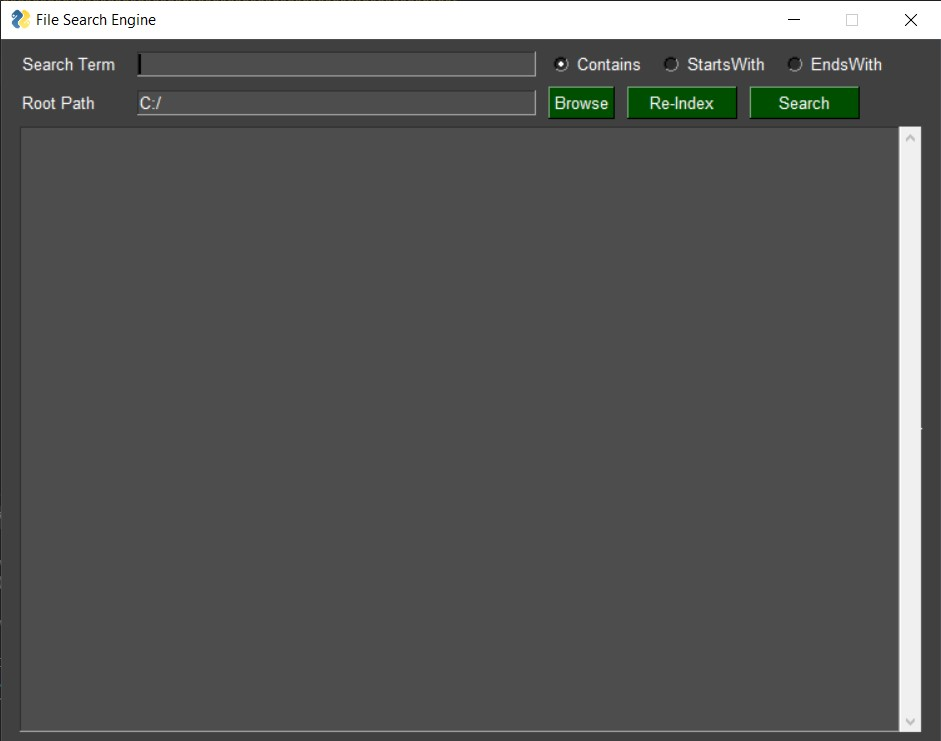

# Local File Search Engine

## Features of program
1. Search the file and shows path as output 
2. Search term with **"Contains", "StartsWith" and "EndsWith"**
3. Select the root directory for the file which enhance the speed of search
4. Re-Index button refresh the search terms for the new directory 

## Sample Images

